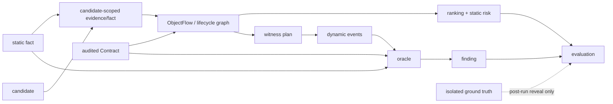

# 证据模型

BoundaryWitness 把“观察”“推导”“验证”和“外部标签”分开存储。核心原则是：结论的强度不得超过其最弱的必要父证据，派生记录必须能回查父记录。

## 对象关系

### `fact`

`fact` 是中性结构化观察。`StaticFactEnvelope` 记录 `record_id`、`build_id`、artifact identity、source ref 和具体 payload；payload 包括 capture、registration、raw transfer、release proof、returned borrow、external buffer、atomic ordering、`ObjectFlow` 与 binding gap。candidate-scoped `V326LifecycleFactRecord` 额外保存 `candidate_id`、coverage、provenance、`object_ids` 与父 `evidence_refs`。

事实的来源只有可审计路径：compiler static artifact、经约束的 source observation 或已物化 Contract。API 名称、变量名和自然语言推测不能伪装成 authoritative fact。

### `candidate`

candidate 由 boundary index 或受支持的静态生命周期事实生成，回答“哪里值得继续分析”。它持有 source evidence、pattern family、confidence 和 next step，但不含动态确认语义。多个 candidate 可以共享分析表面，却不能因此共享对象身份事实。

### 对象链与 ordering

graph-v3 的对象、边与 `V326ObjectChain` 连接 candidate-scoped facts：

- 对象由 `object_id`、kind、source ref 和 `fact_refs` 标识；
- 边记录 relation、ordering、`evidence_refs` 与 `fact_refs`；
- chain 记录对象集合、边集合、事实集合、`verified_layers`、`missing_layers` 和兼容 `chain_status`；
- mutation/reassignment `ObjectBindingGap` 是阻断或降级证据，不能当作全 crate 结论。

proof layers 固定为 `identity_transport`、`lifecycle_ordering`、`complete_risk_chain`。完整定义见[生命周期对象流](lifecycle-object-flow.md)。

### 动态事件与 finding

`RuntimeEventEnvelope` 以 `run_id`、`trace_id`、递增 `seq`、`record_id` 和 payload 记录 object create/drop/free/use、callback register/unregister/invoke、capture bind、checkpoint 与 trace 边界。Oracle 将 static fact index、Contract 和动态状态机组合，输出 `Finding`：rule、classification、subject、first violation event、状态快照、normalized signature、`build_id`、`run_id` 和机器可读 evidence references。

finding 是规则级输出，不自动等于已确认漏洞。`Exposure` 与 `ConfirmedViolation` 仍需结合重放、负对照、sanitizer/UB 证据和人工核验解释。

### oracle 与 ground truth

这里有两个不同概念：

- **oracle engine**：运行时分析组件，消费 static facts、Contract 与 trace，产生 finding；
- **oracle ground truth**：检测流程之外维护的标签、advisory、补丁差分与人工核验，运行后才参与效果评估。

ground truth 不能进入 boundary scan、candidate、ranking、witness search 或初始 seed。blind public manifest/observation 与 private ground truth/reveal 分离，避免标签泄漏。

## 证据成立与不成立

以下内容**单独都不构成验证证据**：

- 工具进程退出成功、测试通过或 CLI 返回 `Success`；
- 文件存在、文件名、目录名、artifact label 或报告标题；
- candidate ID、candidate score、rank、pattern family 或 source proximity；
- `verified_static_chain` 兼容状态但缺少明确 `verified_layers`；
- 自然语言报告、LLM 判断或维护者之外的命名猜测；
- witness plan、harness 源文件或单次 crash。

可审计结论至少需要：版本化 record、有效 Schema、父 evidence/fact refs、同一 run/build/artifact 约束、所需 proof layer，以及与结论等级相匹配的动态重放或独立对照。对动态结论，还要记录环境、重复性、负对照和 outcome 分解。

## Lineage 与失败处理

| 派生物 | 必须保留 | 不能替代 |
| --- | --- | --- |
| lifecycle fact | static record/build/provenance、anchor record、candidate/crate | source 距离、同名 API |
| object chain | object/edge/fact/evidence refs、missing layers | chain ID、边数量 |
| ranked candidate | feature evidence、missing evidence、chain summary、graph path | score、rank |
| finding | static/contract/runtime refs、first event、state snapshot、run/build | message 文本、crash 名称 |
| reveal/receipt | frozen input checksum、method commit、manifest、run receipt | 已揭示标签、手工改名 |

缺证时系统保留 `partial_chain`、`ambiguous_chain`、`observation_only`、`missing_evidence`、coverage gap、tool error 或 unsupported 状态。缺口不能通过 candidate ID 字典序、源码位置接近、分数或经验补齐。

## 代码、契约与测试入口

- 代码：[`crates/bw-model/src/static_fact.rs`](../../crates/bw-model/src/static_fact.rs)、[`crates/bw-model/src/lifecycle_v326.rs`](../../crates/bw-model/src/lifecycle_v326.rs)、[`crates/bw-model/src/runtime_event.rs`](../../crates/bw-model/src/runtime_event.rs)、[`crates/bw-model/src/finding.rs`](../../crates/bw-model/src/finding.rs)、[`crates/bw-oracle/src/oracle.rs`](../../crates/bw-oracle/src/oracle.rs)。
- Schema/Contract：[`schemas/v3-2-6/lifecycle-fact.schema.json`](../../schemas/v3-2-6/lifecycle-fact.schema.json)、[`schemas/v3-2-6/lifecycle-graph-v3.schema.json`](../../schemas/v3-2-6/lifecycle-graph-v3.schema.json)、[`contracts/callback-retention/contract.toml`](../../contracts/callback-retention/contract.toml)。
- 测试：[`crates/bw-model/tests/static_fact_roundtrip.rs`](../../crates/bw-model/tests/static_fact_roundtrip.rs)、[`crates/bw-model/tests/lifecycle_v326.rs`](../../crates/bw-model/tests/lifecycle_v326.rs)、[`crates/bw-oracle/tests/evidence.rs`](../../crates/bw-oracle/tests/evidence.rs)、[`crates/bw-oracle/tests/fact_fusion.rs`](../../crates/bw-oracle/tests/fact_fusion.rs)、[`crates/bw-oracle/tests/properties.rs`](../../crates/bw-oracle/tests/properties.rs)。

边界术语以[项目术语](../project/terminology.md)和[范围与边界](../project/scope-and-boundaries.md)为准。
